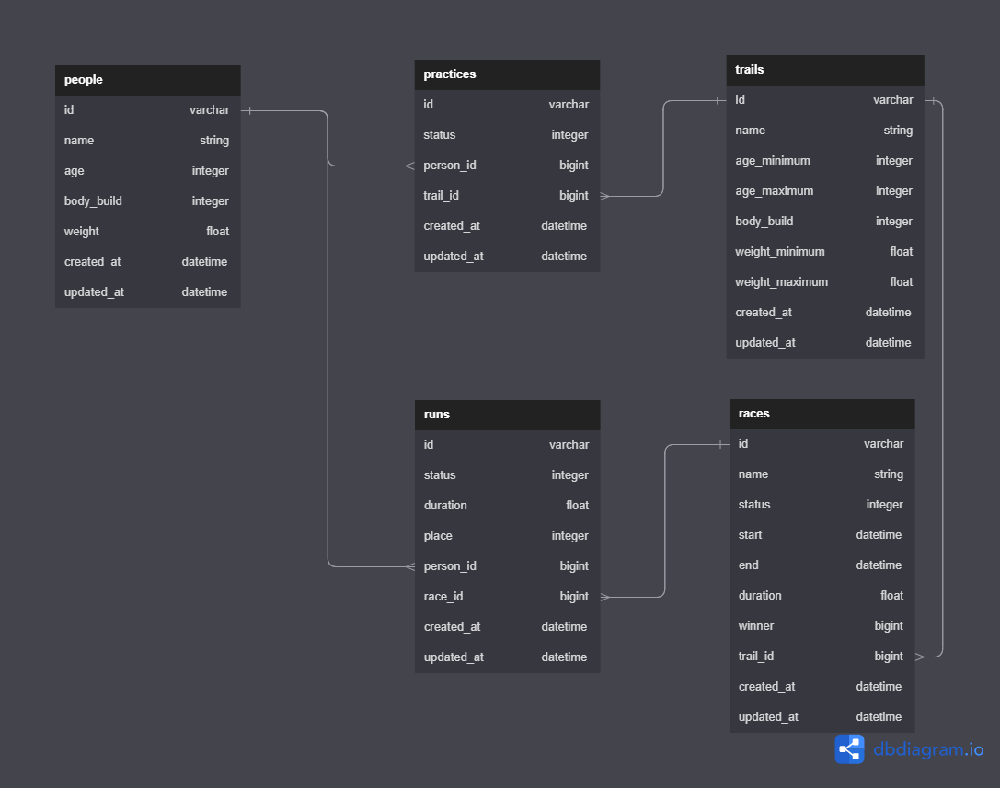

# Trails Exercise
## Feature 1
### Requirements
3 models
 - [x] Person (people table)
 - [x] Trail (trails table)
 - [x] Practice (practices tables)

Person model
 - [x] has age, body-build (slim, fit, large)
 - [x] can `start` *practice* on any *trail*
 - given he/she has passed the criteria of a trail
 - given he/she is not already starting a practice on a trail
 - [x] can `finish` *practice* on a *trail*
 - given he/she is starting this particular trail
 - [x] can see all trails finished
 - [x] can see all uncompleted trails

Trail model
 - [x] has pass criteria depending on age, body-build
 - [x] can see people who have finished this trail
 - [x] can see people who have started the trail
 - [x] can see people who can start the trail

Practice model
 - [x] has the status field of person/trail

### Diagram

## Feature 2

### Requirements
2 models
- [x] Race (table races)
- [x] Run (table runs)

Race model
- [x] belongs to a *Trail*
- [x] can `register` People to join
- [x] can `start`/`end` a race
  - [x] State is manually changed (new → started, started → finished)
- [x] can't start if less than 2 People registered
- [ ] when a Race finishes, assign random duration and status (finished or unfinished) for the racers
  - [ ] declare the fastest runner as winner
- [ ] Can only have 1 winner

Run model
- [x] States: Registered and Dropped (manually changed), Finished and Unfinished (randomly assigned when Race has ended)

Rules
- [x] Trail can have multiple Races but should have different time slots
- [x] Person should have a finished Practice for the Trail before becoming eligible to register for a Race
- [x] Person can only register for a Race once.
- [x] Person cannot register for a Race if there is an ongoing Practice.
- [ ] Person cannot also start a Practice if there is an ongoing Race.
- [x] Person cannot register when Race is already starting or finished
- [ ] Person can register for another Race:
  - [x] For the same Trail (since none of the Races per Trail would overlap)
  - [ ] For another Trail but should not overlap with currently registered Race

Additional
- [ ] Add view on Trail for races list
- [ ] Add view on Person for races list
- [ ] Add view for Races via navbar: `trails/races`
- [x] Don't update Race details if runners have already registered

### Diagram

